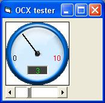



## Custom Gauge OCX \(minor modification\)

### Description

This simple code makes a custom OCX gauge.

Use the min, max, and value properties to customize your gauge.

The supplied tester project demonstrates how you may use the OCX.

You may use this code as a simple reference on how to use "property let"

and "property get" to give properties to your OCX.
 
### More Info
 
min, max, and value properties (like the scroll bar control)

There is a tester project supplied with the ocx project. Use the file Group1.vbg to run the ocx project and the tester project.

min, max, and value properties(like the scroll bar control)

             |
---                |---
**Submitted On**   |2007-02-04 12:18:52
**By**             |[Diaa Eldessouky](https://github.com/Planet-Source-Code/PSCIndex/blob/master/ByAuthor/diaa-eldessouky.md)
**Level**          |Advanced
**User Rating**    |4.5 (18 globes from 4 users)
**Compatibility**  |VB 6\.0
**Category**       |[Custom Controls/ Forms/  Menus](https://github.com/Planet-Source-Code/PSCIndex/blob/master/ByCategory/custom-controls-forms-menus__1-4.md)
**World**          |[Visual Basic](https://github.com/Planet-Source-Code/PSCIndex/blob/master/ByWorld/visual-basic.md)
**Archive File**   |[Custom\_Gau204692282007\.zip](https://github.com/Planet-Source-Code/diaa-eldessouky-custom-gauge-ocx-minor-modification__1-67773/archive/master.zip)

